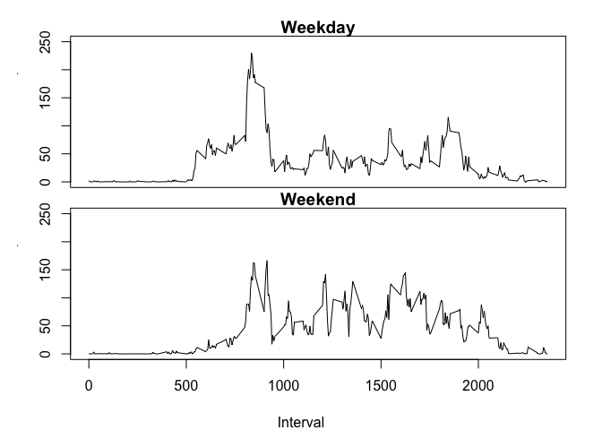

# Reproducible Research: Peer Assessment 1


## Loading and preprocessing the data


```r
##Loads the data
activity <- read.csv("~/Desktop/Data Science Hopkins/Reproducible Research/RepData_PeerAssessment1/activity.csv", 
                     stringsAsFactors=FALSE)

#Processing the data structure
activity$date <- as.Date(activity$date)
```

## What is mean total number of steps taken per day?


```r
#Calculates the total number of steps taken per day
daily_steps <- tapply(activity$steps, 
                   activity$date, 
                   sum, na.rm =TRUE)

#Histogram of total number of steps taken each day
hist(daily_steps)
```

<!-- -->

```r
#Summary displaying, quantiles, mean and median of 
#total steps per day
summary(daily_steps)
```

```
##    Min. 1st Qu.  Median    Mean 3rd Qu.    Max. 
##       0    6778   10400    9354   12810   21190
```

## What is the average daily activity pattern?

```r
##Mean steps per interval
int_mean <- tapply(activity$steps, 
                   activity$interval, 
                   mean, na.rm =TRUE)

##Line plot (time series), of the mean steps
plot(y=int_mean, x= names(int_mean), ylab = "Mean Steps", 
     xlab = "Interval", type = "l", main = "Mean Steps per time")
```

<!-- -->

```r
##Finds the 5 minute interval that, on average, 
##contains the maximum number of steps
int_mean[which.max(int_mean)]
```

```
##      835 
## 206.1698
```
The maximum average number of steps is 206, over the interval 8:35-8:40

## Imputing missing values


```r
##Calculates the total number of missing values in the data
sum(is.na(activity$steps))
```

```
## [1] 2304
```

```r
##Going to substitute all missing data with the mean of that
##time interval

##Initialises new data set to match original
df <- activity

##Replacing missing data with mean of time interval
df[is.na(df$steps),1] <- int_mean[match(df[is.na(df$steps),3],
                                        names(int_mean))]

##Re-calculates the total number of steps per day with estimates
daily_stepsEst <- tapply(df$steps, 
                   activity$date, 
                   sum, na.rm =TRUE)

##Histogram of total steps per day
hist(daily_stepsEst)
```

<!-- -->

```r
##Displaying new summary statistics, including mean and median
summary(daily_stepsEst)
```

```
##    Min. 1st Qu.  Median    Mean 3rd Qu.    Max. 
##      41    9819   10770   10770   12810   21190
```


## Are there differences in activity patterns between weekdays and weekends?


```r
##Creates a list to set day type
list_week <- c("Weekend", rep("Weekday",5), "Weekend")
names(list_week) <- c("Sunday", "Monday", "Tuesday", "Wednesday",
                      "Thursday","Friday", "Saturday")

##Creates new column matching the day of the week to the daytype
df$daytype <- as.factor(list_week[match(weekdays(df$date),
                                        names(list_week))])

##Recalculates mean for both weekdays, and weekends seperate
mean_Wkd <- tapply(df$steps[df$daytype == "Weekday"], 
                   activity$interval[df$daytype == "Weekday"],
                   mean)
mean_Wke <- tapply(df$steps[df$daytype == "Weekend"], 
                   activity$interval[df$daytype == "Weekend"],
                   mean)

##Panel plot of times series of mean for both weekends and weekdays
par(mfrow = c(2,1), mar = c(0,3,1,1) + 0.1 , oma = c(4,1,1,1))
plot(names(mean_Wke), mean_Wkd, ylim = c(0,250), main = "Weekday",
     ylab = "Number of steps", type = "l", xaxt = "n")
plot(names(mean_Wkd), mean_Wke, ylim = c(0,250),main = "Weekend", 
     ylab = "Number of steps", type = "l")
title(xlab = "Interval", outer = TRUE)
```

<!-- -->

